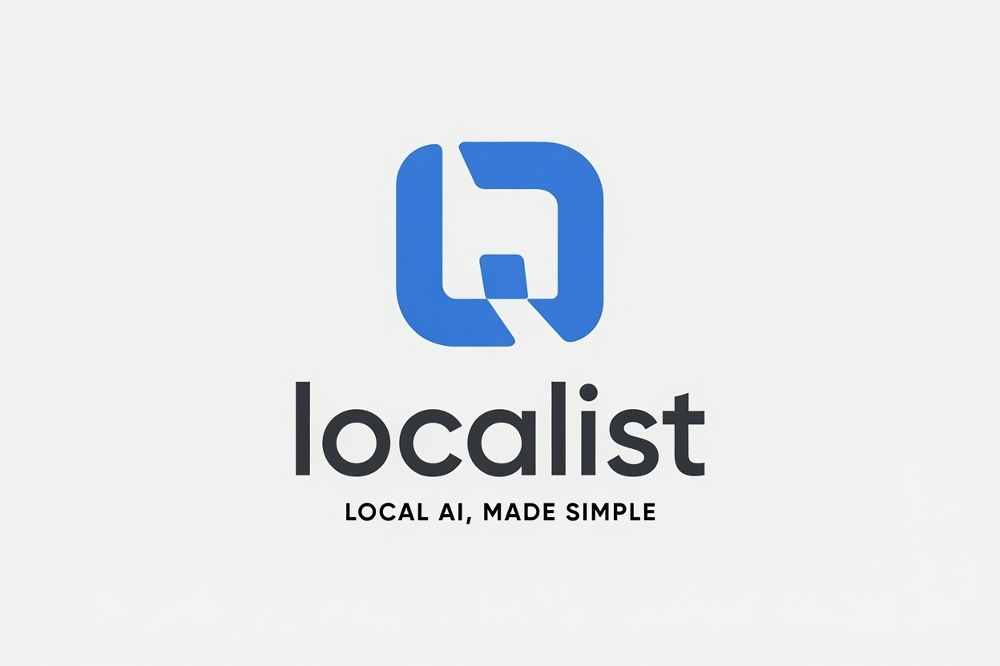

  

# Localist

> **Run AI on your own machine.** Pick your hardware, install one tool, chat with a model that fits — this page gets a beginner there in about 15 minutes.

Localist is a beginner-first guide, not another giant tool list. You start from the
machine you already own, follow one guide, and skip the other 50 options. And it
doesn't rot: a pipeline — not vibes — refreshes the
[Fresh updates](#-fresh-updates) section every morning and stale tools get dropped,
not hoarded.

**Jump to:** [Start here](#-start-here--pick-your-hardware) ·
[The essentials](#-the-essentials) · [Fresh updates](#-fresh-updates) ·
[Glossary](guides/glossary.md) · [Contributing](#-contributing)

---

## 🚀 Start here — pick your hardware

Don't read everything. Find your row, follow one guide, and you'll be chatting with a
local model in under 15 minutes.

| I have… | Your guide |
|---|---|
| **An NVIDIA GPU** (any GeForce RTX) | [NVIDIA GPU path](guides/nvidia-gpu.md) |
| **A Mac with Apple Silicon** (M-series) | [Mac path](guides/mac-apple-silicon.md) |
| **An AMD GPU** (Radeon RX) | [AMD GPU path](guides/amd-gpu.md) |
| **Just a laptop / no GPU** | [CPU-only path](guides/cpu-only.md) |
| **A mini PC or home server** | [CPU-only path](guides/cpu-only.md) — or the [NVIDIA path](guides/nvidia-gpu.md) if it has a GPU |
| **No idea what I have** | [Start here](guides/start-here.md) |

Everything here can run locally; many paths work offline after setup, and your
prompts stay on your machine unless you connect a cloud service.

---

## 🧰 The essentials

One opinionated pick per category. Alternatives are inside each entry — but if
you're new, just take the pick and move on.

**Which tool first?** Want clicks? Start with LM Studio. Comfortable with one
command? Start with Ollama. You do not need both.

| Category | Our pick | Why this one |
|---|---|---|
| **Model runner** | [Ollama](https://github.com/ollama/ollama) | One command to install, one to run a model. The de-facto beginner standard. |
| **Desktop app** | [LM Studio](https://lmstudio.ai) | Point-and-click everything: browse, download, and chat with models. No terminal needed. |
| **Web UI** | [Open WebUI](https://github.com/open-webui/open-webui) | ChatGPT-style interface on top of Ollama. Multi-user, chat with your documents, voice. |
| **Chat models** | [Qwen3 family](https://ollama.com/library/qwen3) | Strong at every size, tiny to huge. Which size fits you → [choosing models](guides/choosing-models.md). |
| **Coding models** | [Qwen Coder](https://ollama.com/library/qwen3-coder) | Same idea, meaningfully better at code. Pairs with the coding agent below. |
| **Coding agent** | [OpenCode](https://github.com/anomalyco/opencode) | Most popular open-source coding agent; points at your local models. |
| **Engine (advanced)** | [llama.cpp](https://github.com/ggml-org/llama.cpp) | The engine most tools are built on. Go direct when you outgrow the wrappers. |
| **Image generation** | [ComfyUI](https://github.com/Comfy-Org/ComfyUI) | Node-based, runs every major open image model. Steeper curve, unmatched power. |
| **Chat with your docs** | [AnythingLLM](https://github.com/Mintplex-Labs/anything-llm) | Point it at a folder and a local model — done. |
| **Speech-to-text** | [whisper.cpp](https://github.com/ggml-org/whisper.cpp) | Fast local transcription on any hardware. |
| **Text-to-speech** | [Piper](https://github.com/OHF-Voice/piper1-gpl) | Fast, natural offline voices — runs even on a Raspberry Pi. |

The full curated set (with licenses, hardware fit, and honest caveats) lives in
[`data/curated.yml`](data/curated.yml) — it's the single source of truth these
picks come from.

---

## 🔥 Fresh updates

New projects and tool releases from the past week, refreshed daily by the pipeline.

<!-- NEWS:START -->
*Updated 2026-07-17*

**🆕 New & active projects**
- [thClaws/thClaws](https://github.com/thClaws/thClaws) — Open-source AI agent harness in native Rust — GUI, CLI, headless, and webapp from one binary. Multi-provider, MCP, skills, plugins, agent teams. · ⭐ 1158
- [Gitlawb/zero](https://github.com/Gitlawb/zero) — The coding agent that answers to you, your model, your machine, your rules. · ⭐ 1089
- [kennss/SiliconScope](https://github.com/kennss/SiliconScope) — Sudoless Apple Silicon system monitor (native SwiftUI GUI) with ANE / Media Engine / memory-bandwidth tracking · ⭐ 750
- [AtomicBot-ai/atomic-agent](https://github.com/AtomicBot-ai/atomic-agent) — Local First Ai Agent. Optimized for Local Ai models. Long context window. Proper tools callings. Runs privately on your device. · ⭐ 723
- [r14dd/patent](https://github.com/r14dd/patent) — A prior-art search for your code ideas — has this dev tool already been shipped? · ⭐ 510
- [giannisanni/pulsar](https://github.com/giannisanni/pulsar) — SSD-streaming inference engine for giant MoE models (Rust + CUDA). GLM 5.2 743B at 2 tok/s and Hy3 295B at 7 tok/s on two consumer 16GB GPUs. Zero-config multi-GPU: measures PCIe bandwidth, places attention and hot experts where they fit. · ⭐ 42
- [deepanwadhwa/samosa-chat](https://github.com/deepanwadhwa/samosa-chat) — Run Qwen3.6-35B-A3B locally on a 16 GB RAM machine · ⭐ 32
- [bbarit/bbarit-agent-oss](https://github.com/bbarit/bbarit-agent-oss) — Open-source AI coding agent for your terminal — one Rust binary, 15+ LLM providers, 1,000+ models. A self-hostable Claude Code / Codex CLI alternative (MIT). · ⭐ 31

**📦 Tool releases**
- [Ollama v0.32.0](https://github.com/ollama/ollama/releases/tag/v0.32.0) — What's Changed New interactive agent experience: running `ollama` now launches an agent to help you code and delegate work
- [vLLM v0.25.1](https://github.com/vllm-project/vllm/releases/tag/v0.25.1) — vLLM v0.25.1 Highlights
- [vLLM v0.25.0](https://github.com/vllm-project/vllm/releases/tag/v0.25.0) — vLLM v0.25.0 Release Notes Highlights
- [KoboldCpp v1.117.1](https://github.com/LostRuins/koboldcpp/releases/tag/v1.117.1) — koboldcpp-1.117.1 Fixed terminal output sometimes not showing thinking traces
- [ComfyUI v0.28.0](https://github.com/Comfy-Org/ComfyUI/releases/tag/v0.28.0) — What's Changed Add AGENTS.md by @comfyanonymous in https://github.com/Comfy-Org/ComfyUI/pull/14696
- [LM Studio 0.4.19](https://lmstudio.ai/changelog/lmstudio-v0.4.19)
- [Ollama v0.32.1](https://github.com/ollama/ollama/releases/tag/v0.32.1) — Improved Gemma 4 tool calling and multi-turn reasoning, including more reliable tool-response continuations Fixed a recurrent MLX model cache leak that could increase memory use across requests, and
<!-- NEWS:END -->

[Full news archive →](news/)

---

## 📚 New to all of this?

The [glossary](guides/glossary.md) explains every term you'll bump into —
GGUF, quantization, context window, VRAM, tokens/sec — in plain words.
And [choosing models](guides/choosing-models.md) answers the #1 question:
*which model size actually fits my machine?*

## 🤝 Contributing

Found a great tool? Spotted a dead project? Open an issue —
[suggest a tool](https://github.com/bokiko/localist/issues/new?template=suggest-tool.yml) ·
[report a stale entry](https://github.com/bokiko/localist/issues/new?template=report-stale.yml).
See [CONTRIBUTING.md](CONTRIBUTING.md) for the ground rules.

## 📄 License

- Code and scripts: [MIT](LICENSE)
- Guides and written content: [CC-BY-4.0](LICENSE-CONTENT)
