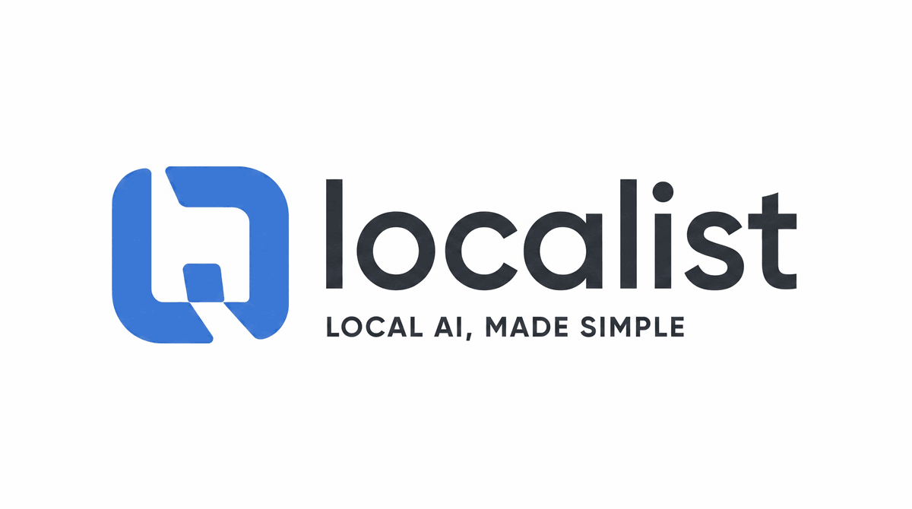
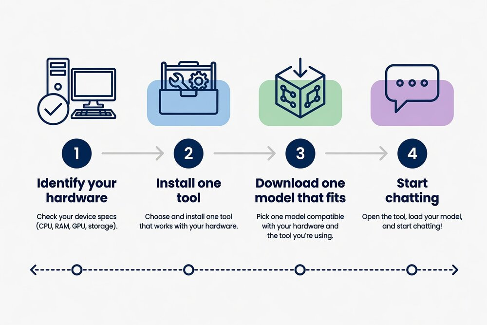

  

# Localist

> **Run AI on your own machine.** Pick your hardware, install one tool, chat with a model that fits — this page gets a beginner there in about 15 minutes.

  <a href="https://medium.com/p/dadded1dda24">Backstory</a> ·
  <a href="https://x.com/bokiko">Follow updates on X</a>

Localist is a beginner-first guide, not another giant tool list. You start from the
machine you already own, follow one guide, and skip the other 50 options. And it
doesn't rot: a pipeline — not vibes — refreshes the
[Fresh updates](#-fresh-updates) section every morning, and we review and prune
stale recommendations instead of hoarding them.

**Jump to:** [Start here](#-start-here--pick-your-hardware) ·
[The essentials](#-the-essentials) · [Fresh updates](#-fresh-updates) ·
[Glossary](guides/glossary.md) · [Contributing](#-contributing)

**Not sure what hardware you have?** → [Work it out in two questions](guides/start-here.md)
· **Something not working?** → [Troubleshooting](guides/troubleshooting.md)

---

## 🚀 Start here — pick your hardware

Don't read everything. Find your row, follow one guide, and you'll be chatting with a
local model in under 15 minutes.

  

| I have… | Your guide |
|---|---|
| **An NVIDIA GPU** (any GeForce RTX) | [NVIDIA GPU path](guides/nvidia-gpu.md) |
| **A Mac with Apple Silicon** (M-series) | [Mac path](guides/mac-apple-silicon.md) |
| **An AMD GPU** (Radeon RX) | [AMD GPU path](guides/amd-gpu.md) |
| **Just a laptop / no GPU** | [CPU-only path](guides/cpu-only.md) |
| **A mini PC or home server** | [CPU-only path](guides/cpu-only.md) — or the [NVIDIA path](guides/nvidia-gpu.md) if it has a GPU |
| **No idea what I have** | [Start here](guides/start-here.md) |

Everything here can run locally; many paths work offline after setup, and your
prompts stay on your machine unless you connect a cloud service.

**Stuck partway?** [Troubleshooting](guides/troubleshooting.md) covers the handful of
things that actually go wrong — including *"where do I type this command?"*, how to
stop the chat, and how to start it again tomorrow.

---

## 🧰 The essentials

One opinionated pick per category. Alternatives are inside each entry — but if
you're new, just take the pick and move on.

**Which tool first?** Want clicks? Start with LM Studio. Comfortable with one
command? Start with Ollama. You do not need both.

| Category | Our pick | Why this one |
|---|---|---|
| **Model runner** | [Ollama](https://github.com/ollama/ollama) | One command to install, one to run a model. The de-facto beginner standard. |
| **Desktop app** | [LM Studio](https://lmstudio.ai) | Point-and-click everything: browse, download, and chat with models. No terminal needed. |
| **Web UI** | [Open WebUI](https://github.com/open-webui/open-webui) | ChatGPT-style interface on top of Ollama. Multi-user, chat with your documents, voice. |
| **Chat models** | [Qwen3 family](https://ollama.com/library/qwen3) | Strong at every size, tiny to huge. Which size fits you → [choosing models](guides/choosing-models.md). |
| **Coding models** | [Qwen Coder](https://ollama.com/library/qwen3-coder) | Same idea, meaningfully better at code. Pairs with the coding agent below. |
| **Coding agent** | [OpenCode](https://github.com/anomalyco/opencode) | Most popular open-source coding agent; points at your local models. |
| **Image generation** | [ComfyUI](https://github.com/Comfy-Org/ComfyUI) | Node-based, runs every major open image model. Steeper curve, unmatched power. |
| **Chat with your docs** | [AnythingLLM](https://github.com/Mintplex-Labs/anything-llm) | Point it at a folder and a local model — done. |
| **Speech-to-text** | [whisper.cpp](https://github.com/ggml-org/whisper.cpp) | Fast local transcription on any hardware. |
| **Text-to-speech** | [Piper](https://github.com/OHF-Voice/piper1-gpl) | Fast, natural offline voices — runs even on a Raspberry Pi. |

When you outgrow beginner tools, [llama.cpp](https://github.com/ggml-org/llama.cpp)
is the engine worth learning — it's what most of the tools above are built on.

The full curated set (with licenses, hardware fit, and honest caveats) lives in
[`data/curated.yml`](data/curated.yml) — it's the single source of truth these
picks come from.

---

## 🔥 Fresh updates

New projects and tool releases from the past week, refreshed daily by the pipeline.
*Pipeline-surfaced projects are not curated recommendations. Start with the
Essentials table above if you want the trusted beginner picks.*

<!-- NEWS:START -->
*Updated 2026-09-22*

**🆕 New & active projects**
- [mizorewww/laya-mlx](https://github.com/mizorewww/laya-mlx) — Native MLX runtime for Laya typed decision models — 7–14 ms short decisions on M3 Max. No text generation, PyTorch, or cloud API. · ⭐ 447
- [mizorewww/laya-coreml](https://github.com/mizorewww/laya-coreml) — Local Laya typed decisions on Apple Core ML and Neural Engine. Validated ports, ~5 ms short decisions on M3 Max, reproducible speed and energy benchmarks. · ⭐ 81
- [inikolax/remiqora](https://github.com/inikolax/remiqora) — Local AI music studio unifying ACE-Step 1.5 and YuE2-3B in one Vue interface — text-to-music generation, stem separation, MIDI transcription, and LoRA fine-tuning, with a built-in multitrack DAW. · ⭐ 58
- [bnsd55/jevmlx](https://github.com/bnsd55/jevmlx) — Jev-style parallel constrained decisions for any MLX model on Apple Silicon. Typed, schema-valid JSON in one forward pass. · ⭐ 40
- [nirbhay41120003/EchoMind](https://github.com/nirbhay41120003/EchoMind) — Local-first voice memory assistant — capture speech, transcribe live, and ask a private RAG chatbot grounded in what you've actually said. No cloud required. · ⭐ 35

**📦 Tool releases**
- [Ollama v0.34.1](https://github.com/ollama/ollama/releases/tag/v0.34.1) — MLX safetensors `ollama create` no longer experimental. GGUF model creation now requires using llama.cpp tooling for safetensor conversion and quantization. Improved MLX memory handling on Apple
- [KoboldCpp v1.121](https://github.com/LostRuins/koboldcpp/releases/tag/v1.121) — _Music generated by @Dampfinchen, clips for music video created entirely in KoboldCpp_ **NEW: Media reference support added for Minimax H3!** - You will now be able to attach audio clips and multiple
- [ComfyUI v0.36.0](https://github.com/Comfy-Org/ComfyUI/releases/tag/v0.36.0) — Add new model blueprints and reorganize subgraph categories main: bump the AMD Windows VA quota to 4TB (CORE-409)
- [Ollama v0.34.2](https://github.com/ollama/ollama/releases/tag/v0.34.2) — Added first-run setup when running `ollama`, with options to sign in or continue locally. Setup completion is shared with the desktop app on macOS and Windows. Added `ollama://apps` to open the
- [LM Studio 1.1.4](https://lmstudio.ai/changelog/bionic-v1.1.4)
- [LM Studio 1.1.5](https://lmstudio.ai/changelog/bionic-v1.1.5)
- [ComfyUI v0.37.0](https://github.com/Comfy-Org/ComfyUI/releases/tag/v0.37.0) — Aimdo 0.5.5 + Auto-detect and enable --fast-disk when the disk is fast (CORE-440) [Partner Nodes] feat(OpenAI): add transparent background support for GPT Image 2
- [vLLM v0.30.0](https://github.com/vllm-project/vllm/releases/tag/v0.30.0) — This release features 762 commits from 315 contributors (104 new)! **New models**: DeepSeek-V4.1-Flash (#56214, #56228, #56208) with the whole KV stored in MXFP8 through the FlashMLA V4.1 record on
- [Open WebUI v0.11.4](https://github.com/open-webui/open-webui/releases/tag/v0.11.4) — Added 📉 **Far smaller slim image.** A slim build now comes down at around 175 MB, near enough 89% smaller than the last release, the local models, the packages around them and the tools that
<!-- NEWS:END -->

[Full news archive →](news/)

---

## 📚 New to all of this?

Don't know what hardware you have? [Start here](guides/start-here.md) works it out in
two questions, and tells you what a local model will and won't do well before you
spend time on it.

The [glossary](guides/glossary.md) explains every term you'll bump into —
GGUF, quantization, weights, context window, VRAM, tokens/sec — in plain words.
And [choosing models](guides/choosing-models.md) answers the #1 question:
*which model size actually fits my machine?*

When something doesn't work, [troubleshooting](guides/troubleshooting.md) is organised
by what you see on screen — not by what went wrong underneath.

## 🤝 Contributing

Found a great tool? Spotted a dead project? Open an issue —
[suggest a tool](https://github.com/bokiko/localist/issues/new?template=suggest-tool.yml) ·
[report a stale entry](https://github.com/bokiko/localist/issues/new?template=report-stale.yml).
If a link, download, or command looks unsafe or compromised, report it privately
through [SECURITY.md](SECURITY.md) instead of a public issue.
See [CONTRIBUTING.md](CONTRIBUTING.md) for the ground rules.

## 📄 License

- Code and scripts: [MIT](LICENSE)
- Guides and written content: [CC-BY-4.0](LICENSE-CONTENT)
