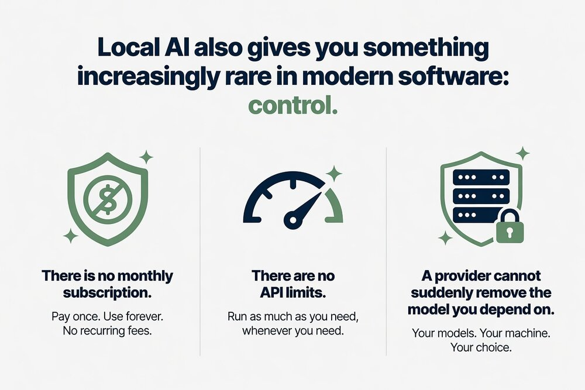

# Start Here — figure out what you have

*Unfamiliar word? The [glossary](glossary.md) explains every term here in plain English.*

You want to run AI on your own machine but don't know where to begin.
Answer two questions and this page routes you to the right guide.

## Question 1: What kind of computer do you have?

### "A Mac"
Click the Apple menu → **About This Mac**. If the chip says **Apple M1, M2, M3, or M4**
(any variant — Pro, Max, Ultra), you're in great shape:

→ **[Mac (Apple Silicon) guide](mac-apple-silicon.md)**

If it says **Intel**, treat it as a CPU-only machine:

→ **[CPU-only guide](cpu-only.md)**

### "A Windows PC or Linux machine"
You need to know your graphics card (GPU):

- **Windows:** press `Ctrl+Shift+Esc` → Performance tab → look for **GPU**
- **Linux:** run `lspci | grep -i vga` in a terminal

**Seeing two of them — "GPU 0" and "GPU 1"?** That's normal on most laptops: one
graphics chip built into the processor, one separate and much faster. **Go by the
faster one.** If either says **NVIDIA** or **AMD / Radeon RX**, that's your answer —
use its row below and ignore the Intel one. Picking the wrong one here is the most
common way people end up running a small model slowly on a machine that could have
run a bigger one quickly.

| Your GPU says… | Go to |
|---|---|
| NVIDIA / GeForce RTX / GTX | [NVIDIA guide](nvidia-gpu.md) |
| AMD / Radeon RX | [AMD guide](amd-gpu.md) |
| Intel Arc / Intel Iris / "integrated" *(and nothing else listed)* | [CPU-only guide](cpu-only.md) *(for now — Vulkan support for Intel GPUs is improving, so this routing may change)* |
| No GPU listed | [CPU-only guide](cpu-only.md) |

## Question 2: How much memory does it have?

This decides how big a model you can run — but **which memory counts depends on
your path**:

- **NVIDIA / AMD GPU paths:** the number that matters is your GPU's own memory
  (**VRAM**) — not your system RAM. Your hardware guide shows how to check it.
- **CPU-only and Mac paths:** the number that matters is your **system RAM**
  (on Apple Silicon, RAM is shared with the GPU).

Rough expectations, using whichever number applies to you:

| VRAM (GPU paths) or RAM (CPU/Mac paths) | What you can expect |
|---|---|
| 8 GB | Small models (3–4B). Fine for chat, summaries, quick questions. |
| 16 GB | Mid-size models (7–14B). Genuinely useful daily-driver territory. |
| 24–32 GB | Large models (14–32B). Quality that rivals cloud chatbots for many tasks. |
| 64 GB+ | The big leagues (70B+). You probably didn't need this page. |

A 16 GB-RAM laptop and a 16 GB-VRAM graphics card are *not* the same tier in
practice — the GPU will feel much faster. For the full size-by-memory breakdown,
see [choosing models](choosing-models.md).

## What "running AI locally" actually gets you

  

- **Privacy** — your conversations never leave your machine
- **Free** — no subscription, no API bills, no rate limits
- **Offline** — works on a plane, works when the internet is down
- **Control** — pick your model, tune it, swap it, no one can take it away

## What this will and won't do well

Worth knowing before you start, so nothing here surprises you into giving up. This
assumes a decent model on 16 GB+ — smaller machines lean further toward the right
column.

| Genuinely good at | Will disappoint you |
|---|---|
| Everyday chat, explaining things, brainstorming | Hard reasoning, tricky maths, long chains of logic |
| Rewriting, summarising, tone and grammar | Anything needing current facts — it has no internet and no live knowledge |
| Coding help on a file or function you paste in | Holding a whole codebase in its head |
| Drafting and editing your own writing | Long documents — speed drops sharply and it starts losing the thread |
| Working offline, privately, unlimited, free | Matching the biggest cloud models on the hardest questions |

**The honest summary:** a good local model is a capable everyday assistant, not a
smaller copy of the best cloud model. For the tasks in the left column most people
stop noticing the difference. For the right column you will notice, and no amount of
setup fixes it — that's the size of the model, not your machine.

**It will also state wrong things confidently.** Every model does; smaller ones do it
more. Check anything that matters.

## Words you'll bump into

Model names look like `qwen3:8b-q4_K_M`. The [glossary](glossary.md) decodes all of it
in plain words. You don't need it to get started — your hardware guide gives exact
commands to copy-paste.

## Two things to know before you go

**If something goes wrong**, it's almost certainly one of a handful of common things,
and none of them break your computer → **[troubleshooting](troubleshooting.md)**.

**When you're done chatting**, your model stays on your disk either way — you only
download it once. Using an app? Just close it. At a terminal prompt? Type `/bye`. The
[how do I get back tomorrow](troubleshooting.md#how-do-i-get-back-tomorrow) section
has the two-line version for both.

---

**Now pick your guide** — [Mac](mac-apple-silicon.md) ·
[NVIDIA](nvidia-gpu.md) · [AMD](amd-gpu.md) · [CPU-only](cpu-only.md) —
or go back to [the hardware table](../README.md#-start-here--pick-your-hardware).
